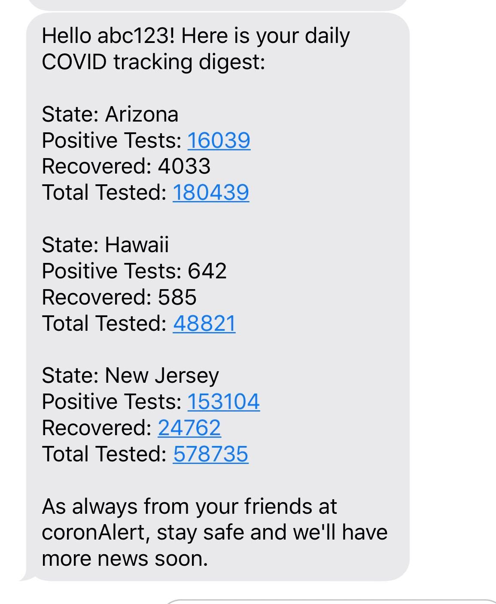

# coronAlert back end api 

This application was borne out of the idea that it is challenging for those of us with loved ones spread around the globe to keep track of coronavirus cases. We wanted something to allow us to get the numbers on cases, recoveries, and fatalities in one place.

The application has the ability for a user to create customizable alerts, so that in addition to a US wide map they can track the specific statistics in states where their loved ones live.

Our backend API utilizes Flask, Mongo, and the Twilio API to give users personalized alerts for states that their loved ones live in so they can stay up to date on the lateset news. 

Here's an example text: 

# To run the app locally 

- select git clone, clone this repo locally
- `cd open-hacks-team-rdu-be` 
- If you wish, you can activate a virtual environment before installing dependencies 
- `pip -r install requirements.txt` 
- run `flask run` and the frontend will be able to interact with the API 

# Future Improvements 

To keep the app relevant, we intend to:

    Add vaccination information when one becomes available
    Add other countries! The APIs exist, we just didn't have time to build logic for them all in this hackathon

